# Uno Q Web Kiosk

A "deploy and forget" web kiosk. A monitor shows one web page, full screen, forever.
The client can change which page it shows, and which Wi-Fi network it uses, from a
keyboard and mouse — with no SSH, no terminal, no address bar, and no way to wander
off into the rest of the system. It survives being switched off at the breaker.

Built on the **Arduino UNO Q** (Debian 13 "trixie" on its Qualcomm QRB2210 Linux side)
and an **Anker 543 USB-C hub**, provisioned by a single script.

<p align="center">
  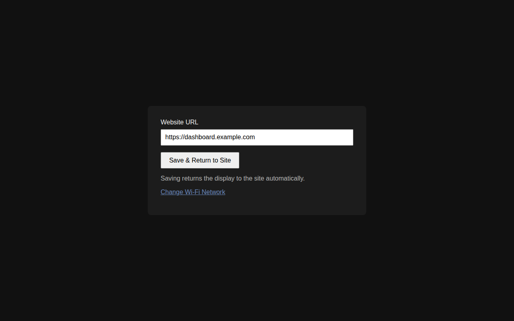
  <br><sub>The settings screen the client sees after pressing <b>Ctrl+Alt+S</b>.</sub>
</p>

**Contents**

- [Part 1 — Installation](#part-1--installation)
  - [What you need](#what-you-need)
  - [Step 1: Prepare the board with Arduino App Lab](#step-1-prepare-the-board-with-arduino-app-lab)
  - [Step 2: Run the provisioning script](#step-2-run-the-provisioning-script)
  - [Step 3: Verify the kiosk](#step-3-verify-the-kiosk)
  - [Step 4: Install on site](#step-4-install-on-site)
  - [Using the kiosk (client guide)](#using-the-kiosk-client-guide)
- [Part 2 — Architecture](#part-2--architecture)
  - [Overview](#overview)
  - [Boot sequence](#boot-sequence)
  - [Display loop and settings mode](#display-loop-and-settings-mode)
  - [The settings server](#the-settings-server)
  - [Changing Wi-Fi and the privilege boundary](#changing-wi-fi-and-the-privilege-boundary)
  - [Power-cut resilience](#power-cut-resilience)
  - [Design decisions](#design-decisions)
  - [Maintaining an already-provisioned board](#maintaining-an-already-provisioned-board)
  - [Known limitations](#known-limitations)
  - [File layout](#file-layout)

---

# Part 1 — Installation

## What you need

| Item | Notes |
|---|---|
| **Arduino UNO Q, 4GB RAM / 32GB eMMC** | The 2GB variant works but leaves little headroom once Chromium, Debian and the settings server are all running. |
| **Anker 543 USB-C hub (6-in-1)** | Plugs into the board's single USB-C port (DisplayPort Alt Mode + Power Delivery). Provides HDMI out, 2× USB-A, Gigabit Ethernet and power-in. |
| USB-C wall charger (PD) | Powers the board *through* the hub's PD-IN port. |
| HDMI monitor + cable | 4K@30Hz max through the hub — fine for a dashboard or static page. |
| USB keyboard + mouse | Only needed when changing settings; can be unplugged during normal display. |
| A computer (Windows/Mac/Linux) | For the one-time App Lab setup and for running the script over SSH. |
| USB-C data cable | Computer ↔ board, for the App Lab step only. |

This is how everything connects once it's installed:

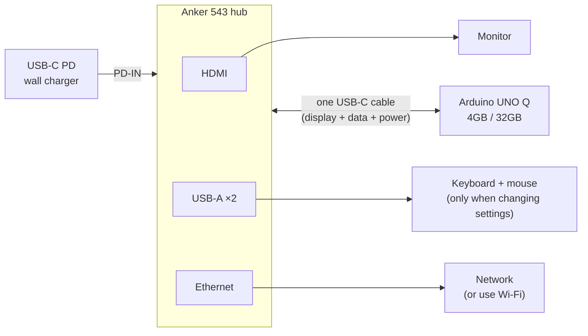

## Step 1: Prepare the board with Arduino App Lab

This part is manual. It needs Arduino App Lab's interactive setup wizard and a direct
USB-C connection from your computer to the board. Do it once per board.

1. **Install [Arduino App Lab](https://www.arduino.cc/en/software/#arduino-app-lab)**
   on your computer.
   *Linux only:* you may need to add udev rules for the board before App Lab can see it.
2. **Connect the UNO Q to your computer** with a USB-C data cable.
3. **Flash the latest stock Arduino Linux image** from App Lab (or with
   `arduino-flasher-cli flash latest` if the board is already detected). Starting from
   the stock image gives every board a known-clean baseline. Before first setup the
   login is `arduino` / `arduino`.
4. **Run App Lab's first-boot wizard:**
   - Join the board to Wi-Fi (or plug in Ethernet later — either works).
   - **Set a real password** for the `arduino` user. Store it in your password
     manager, not in this repo.
   - Optionally give the board a distinct hostname (e.g. `KioskArduino-2`). This helps
     once you have more than one.
   - App Lab turns on SSH and Network Mode automatically once the board is on the
     network.
5. **Confirm SSH works** from your computer before moving on:

   ```bash
   ssh arduino@<board-ip-or-hostname>
   ```

## Step 2: Run the provisioning script

[`provision-kiosk.sh`](provision-kiosk.sh) does everything else in one run: it
installs packages, writes the kiosk files, and sets up the autostart entries, the
settings hotkey, autologin, the systemd services, the Wi-Fi helper and the read-only
root. Then it reboots into a working kiosk.

1. **Copy the script to the board:**

   ```bash
   scp provision-kiosk.sh arduino@<board-ip-or-hostname>:~/
   ```

2. **SSH in and run it** with the page the kiosk should show. The URL must start with
   `http://` or `https://`.

   ```bash
   ssh arduino@<board-ip-or-hostname>
   chmod +x provision-kiosk.sh
   ./provision-kiosk.sh "https://the-client-url-goes-here"
   ```

3. **Enter the board's password when `sudo` asks.** That's expected.
4. **Wait for it to reboot.** It will print a series of `==>` steps (package installs
   take the longest) and finish with `Provisioning complete. Rebooting...`. Your SSH
   session will drop at that point.

> [!IMPORTANT]
> Run the script **once, on a freshly flashed board.** Its last step turns the root
> filesystem read-only. After that, changes to anything outside `/home/arduino` need
> the procedure in [Maintaining an already-provisioned board](#maintaining-an-already-provisioned-board).
> If you need to start over, reflash the board (Step 1) and run the script again.

## Step 3: Verify the kiosk

With a monitor, keyboard and mouse connected, work through this checklist after the
reboot:

- [ ] The board boots straight to the client's page, full screen, with no login
      prompt and no App Lab window.
- [ ] The mouse cursor disappears after about a second of not moving.
- [ ] **Ctrl+Alt+S** opens the settings screen.
- [ ] Changing the URL and clicking **Save & Return to Site** shows the new page.
- [ ] **Change Wi-Fi Network** lists nearby networks, and **Back to Settings** returns.
- [ ] After pulling the power and plugging it back in, the kiosk comes back on the
      page you last saved.

Optionally, check the internals over SSH:

```bash
findmnt /              # should show: overlayroot ... overlay
findmnt /home/arduino  # should show: /dev/mmcblk0p69 ... ext4
systemctl is-active kiosk-server.service   # active
cat ~/kiosk/config.json                    # {"url": "..."}
```

## Step 4: Install on site

1. Power the board down and disconnect it from your computer.
2. Plug the **Anker hub** into the board's USB-C port.
3. Connect the monitor (HDMI), Ethernet if you're using it, and keyboard/mouse.
4. Plug the **USB-C wall charger into the hub's PD-IN port.** The board powers up and
   boots straight into the kiosk.
5. If the site uses a different Wi-Fi network than the one set up in Step 1, change it
   on the spot with [Change the Wi-Fi network](#change-the-wi-fi-network) below.

It's fine for the client to turn the kiosk off at the breaker or pull the plug. It's
designed for that (see [Power-cut resilience](#power-cut-resilience)).

## Using the kiosk (client guide)

Everything the client can do starts from **Ctrl+Alt+S**. They never see a browser,
desktop, or terminal.

### Change the displayed page

1. Plug in a keyboard and mouse.
2. Press **Ctrl+Alt+S**. The settings screen opens.
3. Replace the address in **Website URL** (it must start with `https://` or `http://`).
4. Click **Save & Return to Site**. The kiosk switches to the new page on its own.

### Change the Wi-Fi network

1. Press **Ctrl+Alt+S**, then click **Change Wi-Fi Network**.
2. Pick the network from the list. Networks are sorted by signal strength, and 🔒
   marks ones that need a password. The network the kiosk is on now is shown at the
   top.
3. Enter the password (if asked) and click **Connect**.
4. On success the kiosk returns to the page after a few seconds, or right away with
   **Continue Now**. On failure it shows the reason and a **Try Again** button, and
   the current connection is left alone.

The new network is remembered across reboots and power cuts.

<table>
  <tr>
    <td width="50%">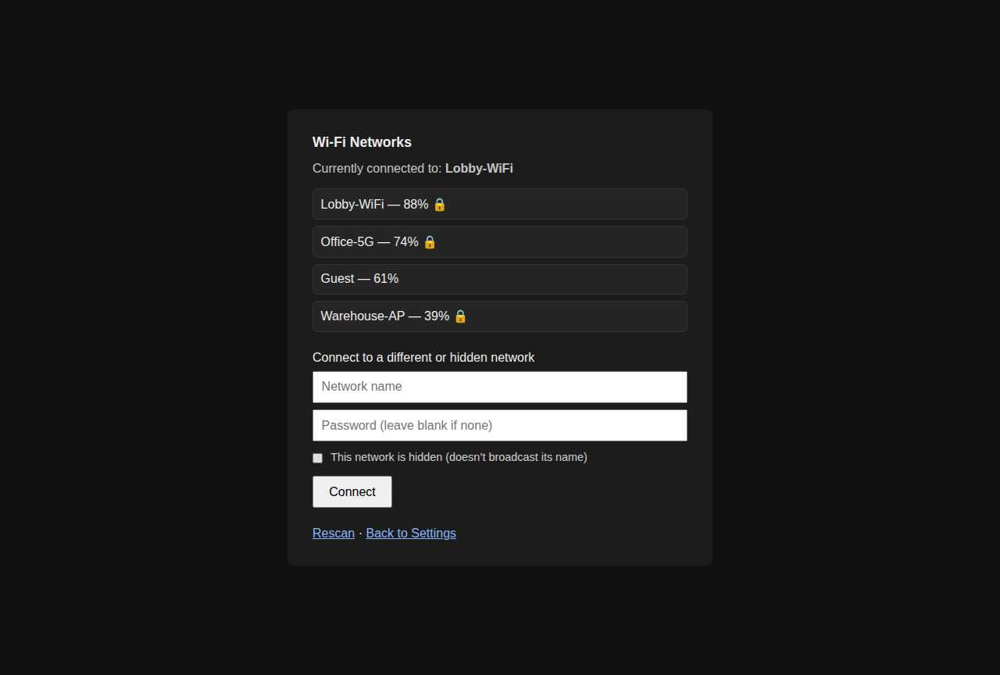</td>
    <td width="50%">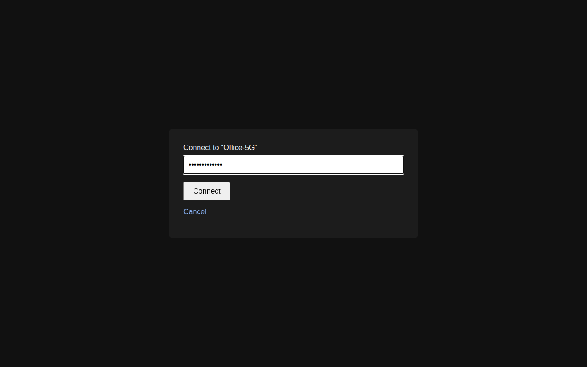</td>
  </tr>
  <tr>
    <td align="center"><sub>1. Pick a network</sub></td>
    <td align="center"><sub>2. Enter its password</sub></td>
  </tr>
  <tr>
    <td width="50%">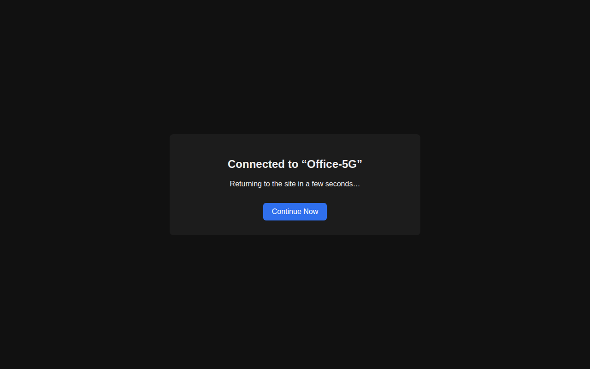</td>
    <td width="50%">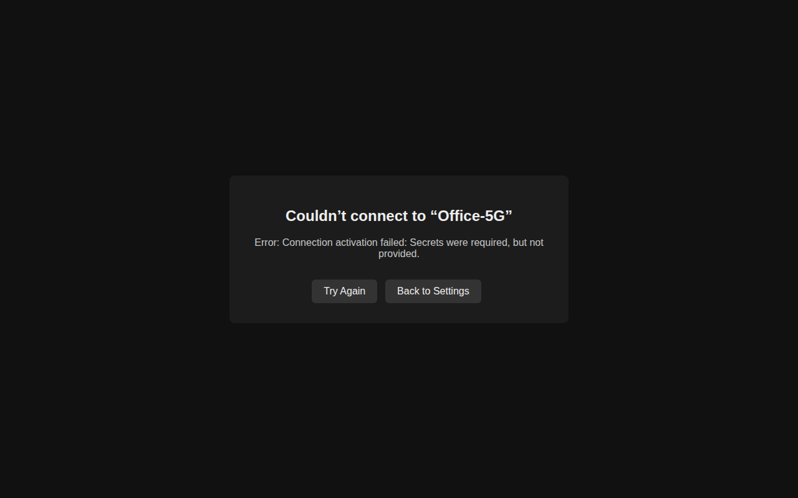</td>
  </tr>
  <tr>
    <td align="center"><sub>3a. Connected — returns to the page automatically</sub></td>
    <td align="center"><sub>3b. Failed — shows why, nothing changed</sub></td>
  </tr>
</table>

**Network not in the list?** Type its name (and password) in **Connect to a different
or hidden network**. Only tick **This network is hidden** if the network really doesn't
broadcast its name. Leave it unticked for a normal network you're just typing by hand.

---

# Part 2 — Architecture

## Overview

The kiosk is a small set of cooperating pieces on a stock Debian desktop (XFCE +
lightdm). No custom kernel or image is involved.

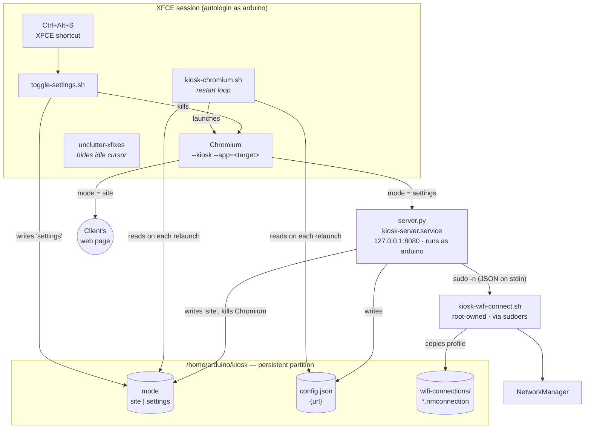

The main idea: **killing Chromium is how the kiosk switches pages.** Nothing
talks to the browser directly. Every change goes like this:

1. Write the new state to a file.
2. Kill Chromium.
3. The restart loop relaunches it and reads the files again.

This keeps each piece simple and means a Chromium crash recovers the same way a URL
change does.

## Boot sequence

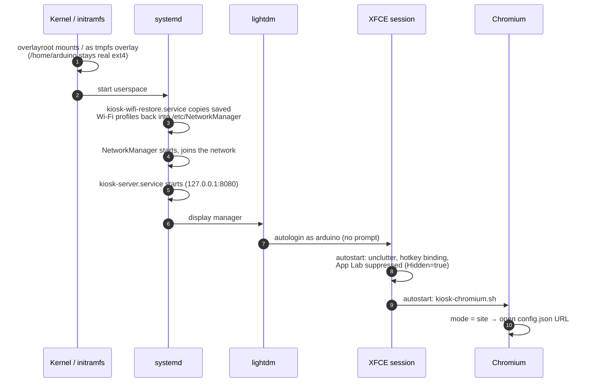

## Display loop and settings mode

`kiosk-chromium.sh` is an endless loop. Each time round, it reads `mode`:

- **`site`**: it launches Chromium on the URL in `config.json`.
- **`settings`**: it launches Chromium on `http://localhost:8080/settings`.

When Chromium exits for any reason, the loop waits a second and launches it again.
Before launching, it also turns off screen blanking and DPMS, so the monitor never goes
to sleep.

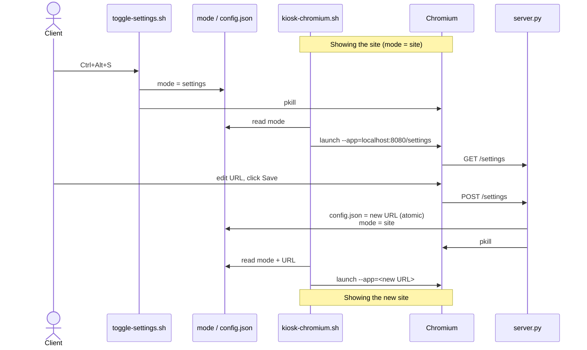

Chromium runs with these flags:

- `--kiosk --app=<target>`: full screen, with no tabs, address bar or menus.
- `--incognito` and `--disable-session-crashed-bubble`: no "Restore pages?" prompt
  after a power cut.
- `--noerrdialogs --disable-infobars --disable-translate --no-first-run`: no popups
  on top of the page.

## The settings server

`server.py` is a single file that only uses the Python standard library (`http.server`),
so there's nothing to `pip install`. It runs as the `kiosk-server.service` systemd
unit, as the **unprivileged `arduino` user**, and listens on **`127.0.0.1:8080`
only**, so nothing on the network can reach it.

| Route | Method | What it does |
|---|---|---|
| `/settings` | GET | URL form, pre-filled with the current URL |
| `/settings` | POST | Validates `http(s)://`, writes `config.json` atomically, returns to site |
| `/wifi` | GET | Rescans and lists networks (strongest first, de-duplicated), shows current network |
| `/wifi/connect` | GET | Password step for the chosen network (skipped for open networks) |
| `/wifi/connect` | POST | Hands the attempt to the root helper; shows success or failure page |
| `/wifi/return-to-site` | GET | Sets `mode = site` and kills Chromium |
| anything else | GET | Redirects to `/settings` |

Every write is **atomic**. The server writes to a temp file in the same directory,
then `rename()`s it over the real file. A power cut mid-save leaves either the old
file or the new one, never a half-written one.

Every Wi-Fi network name (SSID) goes through `html.escape()` before it's shown. Anyone
in radio range can broadcast any network name, including `<script>` tags, so these
count as untrusted input.

## Changing Wi-Fi and the privilege boundary

Joining a network needs root, but the web server shouldn't run as root. The server
passes just that one step to a small root-owned helper script:

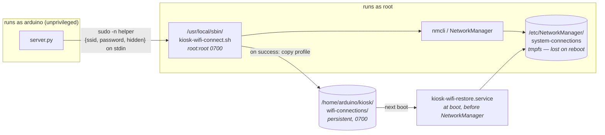

- **Narrow grant.** `/etc/sudoers.d/kiosk-wifi` allows `arduino` to run exactly one
  command as root, with no password. The provisioning script checks the file with
  `visudo -c` before installing it.
- **The helper sits outside `/home/arduino` on purpose.** If it lived in a directory
  `arduino` owns, `arduino` could replace it and turn that single-command grant into
  full root access. Where it is now, `arduino` gets "Permission denied" trying to
  change or delete it (checked on real hardware).
- **The password goes in on stdin as JSON,** never on the server's or helper's command
  line or in any log.
- **The helper sets up the connection itself instead of using nmcli's shortcut.** For
  secured networks it runs `nmcli connection add` (new network) or
  `nmcli connection modify` (saved network), always setting `key-mgmt wpa-psk` and the
  `psk` explicitly, then runs `connection up`. The shortcut command
  `nmcli device wifi connect … password …` has bugs where it drops `key-mgmt`, both for
  hidden networks and when updating a saved network's password. Those bugs made the
  connection fail with the right password (`802-11-wireless-security.key-mgmt:
  property is missing`). Open networks still use the shortcut.
- **Attempts are capped at 45 seconds with `timeout`.** A wrong password makes
  NetworkManager retry for a long time, so without the limit the page could hang.
- **A failed attempt on a new network deletes the half-made profile.** The board
  stays on its previous connection.
- **Saved networks survive reboots.** NetworkManager stores profiles under `/etc`, which
  is wiped on every reboot (see below). So after a successful connect the helper copies
  the profile to `/home/arduino/kiosk/wifi-connections/`, and
  `kiosk-wifi-restore.service` copies it back before NetworkManager starts.

## Power-cut resilience

The client switches the kiosk off at a breaker, so it never gets a clean shutdown.
To make that safe, **nothing on the system partition is ever written to after boot.**

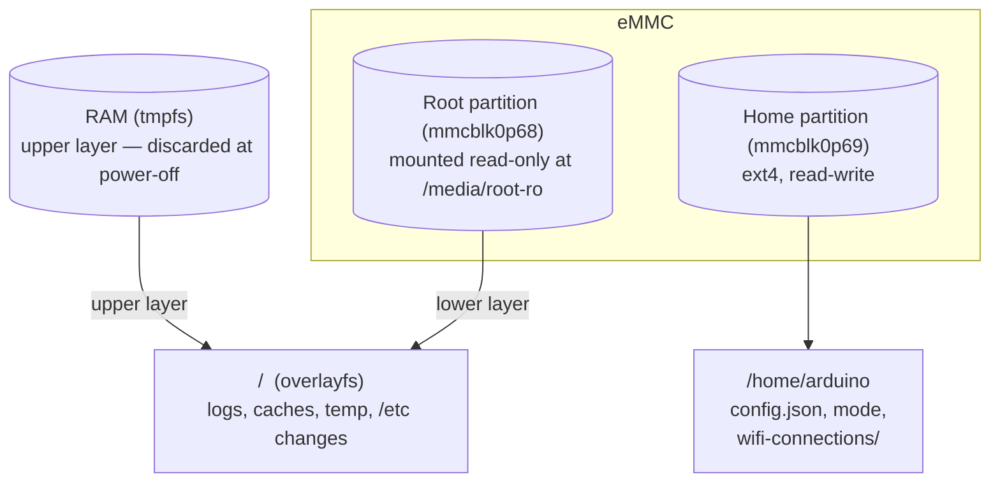

- **`/` is an overlay.** Debian's `overlayroot` package stacks a RAM-backed layer over
  the real root partition, which is mounted read-only. Logs, browser cache, and even
  `apt` installs and edits under `/etc` land in RAM and disappear at power-off. A power
  cut can't corrupt the system because the system isn't being written to.
- **`/home/arduino` is a separate real partition** on the stock image. It holds the
  only data that must survive a reboot: the URL, the mode flag, and saved Wi-Fi
  profiles. It's only written when the client saves something, and always atomically.
- **The important setting is `overlayroot="tmpfs:recurse=0"`** in
  `/etc/overlayroot.conf`. The default, `recurse=1`, would also put `/home/arduino`
  behind the RAM layer. Everything would look fine until the first reboot, when the
  client's saved URL would silently disappear.
- **The provisioning script turns on overlayroot as its very last step.** Every step
  before it is a normal write to a root that isn't read-only yet, so no special handling
  is needed during setup.

## Design decisions

**Why navigate straight to the client's page instead of embedding it (iframe)?**
The first design wrapped the client's site in a local page (an iframe) with a settings
gear icon on top. Most real sites send `X-Frame-Options` or CSP headers that stop
other pages from embedding them, so Chromium just showed "This page couldn't load".
Loading the site directly works with any site. The cost is that there's no on-screen
button, which is why settings are behind a keyboard shortcut instead.

**Why a provisioning script instead of cloning a finished board's eMMC?**

- Arduino's `arduino-flasher-cli` can only write its own stock image. It can't capture
  a customised board.
- People report kernel panics after copying one UNO Q's disk to another with `dd`.
- The partition table includes per-board partitions (`bdaddr`, `wlanaddr`) holding the
  Bluetooth and Wi-Fi MAC addresses. Copying those would give every board the same
  addresses.

A flash-then-script approach avoids all three problems.

**Why the UNO Q rather than a Raspberry Pi?**
The board was chosen for its Linux + microcontroller design. A Pi 4 or Pi 5 would also
run this software with small changes (it has HDMI built in, so no hub is needed), if
the microcontroller side is never needed.

**Why hide App Lab?** The stock image starts the Arduino App Lab desktop app, with a
welcome dialog, on every login. That would appear on top of the kiosk. The script adds
a per-user override (`~/.config/autostart/ArduinoAppLab.desktop` with `Hidden=true`)
so it never starts. This is an ordinary file in `/home/arduino`, so it doesn't need
any changes under `/etc`.

## Maintaining an already-provisioned board

> [!WARNING]
> Once the board is provisioned, `/` is temporary. `apt-get install`, edits under
> `/etc`, new files in `/usr/local` and so on **look** like they worked, but they only
> exist in RAM and **disappear on the next reboot.** Only changes under `/home/arduino`
> are kept.

Changes under `/home/arduino` (e.g. editing `~/kiosk/server.py`) persist normally.
Restart the service afterwards with `sudo systemctl restart kiosk-server`.

To make a **permanent** change anywhere else, write to the real root partition
directly:

```bash
sudo mount -o remount,rw /media/root-ro

# Editing a file: edit it under /media/root-ro, e.g.
sudo nano /media/root-ro/etc/overlayroot.conf

# Installing a package: chroot in. /etc/resolv.conf must be bind-mounted too — the
# real disk's own copy is an empty stub; live DNS settings only exist in the overlay.
sudo mount --bind /dev  /media/root-ro/dev
sudo mount --bind /proc /media/root-ro/proc
sudo mount --bind /sys  /media/root-ro/sys
sudo mount --bind /run  /media/root-ro/run
sudo mount --bind /etc/resolv.conf /media/root-ro/etc/resolv.conf
sudo chroot /media/root-ro apt-get update
sudo chroot /media/root-ro apt-get install -y <package>
sudo umount -l /media/root-ro/dev /media/root-ro/proc /media/root-ro/sys \
               /media/root-ro/run /media/root-ro/etc/resolv.conf

# Always finish with:
sudo mount -o remount,ro /media/root-ro
sudo reboot   # then re-check the change actually survived
```

**Always reboot and check the file again.** The live view can show your change even
when it only exists in RAM.

**One exception:** a completely *new* file written to `/media/root-ro` shows up in the
live system straight away, with no reboot. Overlayfs falls through to the real disk
for anything the RAM layer hasn't touched. Changing or deleting a file that already
exists still needs a reboot to confirm.

The files under `/` that are most likely to need changes are
`/usr/local/sbin/kiosk-wifi-*.sh`, `/etc/sudoers.d/kiosk-wifi`, the systemd units and
the lightdm config. When editing anything in `sudoers.d`, check it with
`sudo visudo -c -f <file>` before putting it in place. A broken sudoers file can break
`sudo` for the whole system.

## Known limitations

- **Pages that need a login.** Chromium runs `--incognito`, so logins don't persist.
  Every restart (URL change, crash, reboot) goes back to the login screen. Fine for
  public pages. If a target needs a login, either enable anonymous/public access on
  that service, or remove `--incognito` from `kiosk-chromium.sh`. The Chromium profile
  would then persist in `/home/arduino`, at the cost of possible "Restore pages?"
  prompts after power cuts.
- **The home partition isn't checked at boot (no `fsck`).** `/home/arduino` is the only
  place still written to, so it's the only place a badly timed power cut could do
  damage. Atomic writes make this unlikely, and a boot-time check hasn't been needed.
- **The Wi-Fi password is briefly visible to other processes.** While `nmcli` runs, the
  password is on its command line, so something like `ps` on the board could see it for
  a moment. This is accepted because the boards have no other user accounts.
- **The provisioning script has only been run from start to finish on one board.**
  Every step was tested on real hardware, but do the first new board as a supervised
  dry run, working through the [verification checklist](#step-3-verify-the-kiosk).

## File layout

```
provision-kiosk.sh      # run once per freshly flashed board
README.md               # this file
PROJECT-LOG.md          # development history and decision log
docs/images/            # screenshots used in this README
```

What the script installs on the board:

```
/home/arduino/kiosk/                          # persistent partition
  server.py                                   # settings server (127.0.0.1:8080)
  kiosk-chromium.sh                           # Chromium restart loop
  toggle-settings.sh                          # Ctrl+Alt+S target
  config.json                                 # {"url": "..."}
  mode                                        # "site" | "settings"
  wifi-connections/                           # saved Wi-Fi profiles (0700)
/home/arduino/.config/autostart/
  kiosk-chromium.desktop
  unclutter.desktop
  ArduinoAppLab.desktop                       # Hidden=true (suppresses stock App Lab)
/home/arduino/.config/xfce4/xfconf/xfce-perchannel-xml/
  xfce4-keyboard-shortcuts.xml                # Ctrl+Alt+S binding

/etc/lightdm/lightdm.conf.d/50-autologin.conf # system partition (read-only after provisioning)
/etc/systemd/system/kiosk-server.service
/etc/systemd/system/kiosk-wifi-restore.service
/etc/overlayroot.conf                         # overlayroot="tmpfs:recurse=0"
/etc/sudoers.d/kiosk-wifi                     # one NOPASSWD command
/usr/local/sbin/kiosk-wifi-connect.sh         # root:root 0700
/usr/local/sbin/kiosk-wifi-restore.sh         # root:root 0700
```
